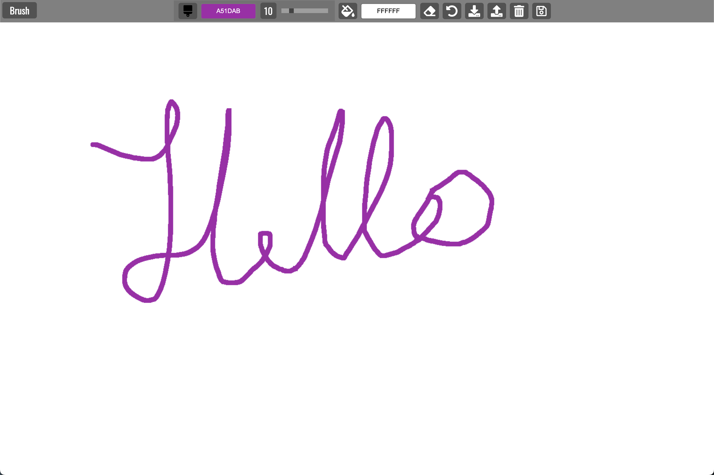

# Paint clone

## URL

https://vasildimov98.github.io/19.paint-clone/

## Description

PaintClone is a simple yet powerful web-based application designed for practicing your artistic skills and unleashing your creativity. As a clone of the popular paint application, it provides a familiar and user-friendly interface that allows you to draw, paint, and express your imagination in a digital canvas.

Unleash your inner artist with PaintClone, the perfect practice ground for your creativity. Dive into a world of vibrant colors, limitless possibilities, and endless fun. Whether you're sketching, painting, or experimenting with new techniques, PaintClone is your virtual canvas to express yourself and bring your imagination to life. Get ready to create art like never before!

